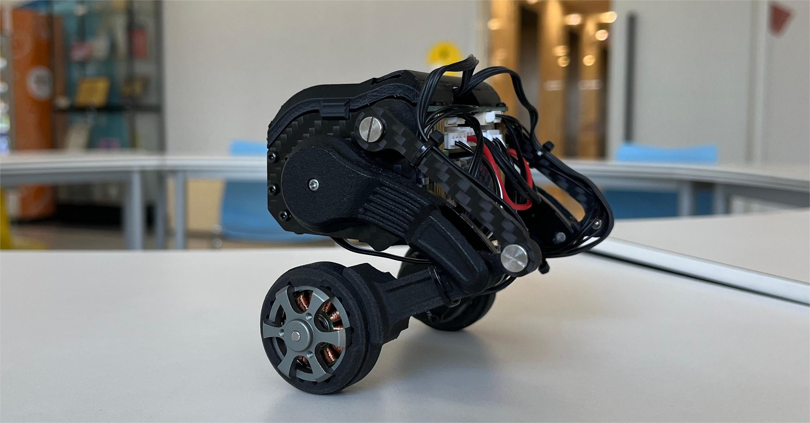
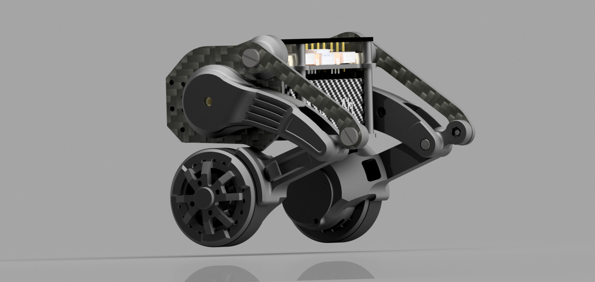
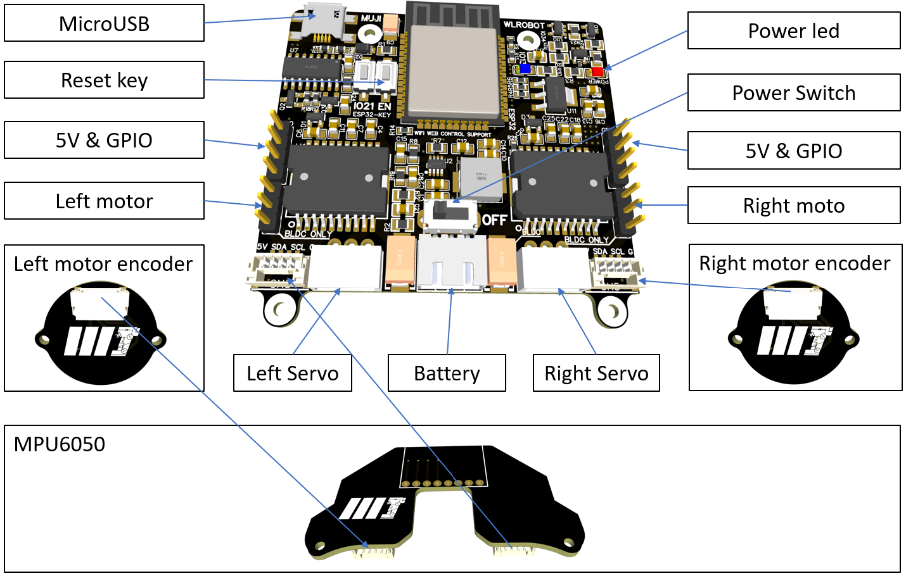

# Micro-Wheeled_leg-Robot
> **The smallest two-wheeled-leg robot!**
>
> Vedio：[[自制]首款桌面级双轮腿机器人](https://www.bilibili.com/video/BV1io4y1q73L/?spm_id_from=333.999.0.0)
>

| Real Robot        | 3D Design        |
| ------------ | ------------ |
|  |  |

> 项目中电路板绘制使用嘉立创EDA，代码使用Arduino IDE，真的十分适合对机器人感兴趣的初学者复刻，预祝同学们成功！

### 机械结构资料说明

* "OriginalRobotModel.stp"为机器人模型文件。
* "Parts-Manufactured"文件夹为要自己加工生产的零件，主要有尼龙粉末烧结3D打印，金属件CNC和板材切割三种方式。
* "Parts-Purchased"文件夹为要购买的零件。
* 部分轴和轴承的安装有可能需要用到平口钳。
* 编码器磁铁需要使用502胶水粘到电机转轴端面上。

### 电路板资料说明

* 有四张PCB需要自制；电路板提供了原理图和PCB的源文件，IDE使用的是[嘉立创EDA](https://lceda.cn/)。
* 其中主控板基于ESP32，无刷电机驱动芯片为L6234PD013TR，这个淘宝上有很多假芯片，大家买的时候注意。
* 编码器芯片为AS5600,使用I2C接口与主控板通讯。
* IMU使用的MPU6050模块，和右侧编码器共用一个I2C接口。
* 舵机调试板将串口的两根线统一成一根信号线来完成，通过分时复用来发送和接收数据信息。
* 除此之外，还需3根GH1.25 4PIN的双头连接线，推荐长度15cm，这个需单独购买。
* 电源正负极丝印已修正。按手册里的电池购买链接插电池没问题，其他品牌电池请注意辨别电源正负端。

| Wire Connection    | 
| ------------ |
|  |

### 源代码使用说明

* 基于[Arduino IDE](https://www.arduino.cc/)，十分简单。
* 轮子无刷电机驱动基于[simpleFOC](https://www.simplefoc.com/#simplefoc_library)。
* 左侧总线舵机ID为1，右侧为2；标定腿部完全蹲下到机械限位位置为2048；使用[FEETECH Debug Software](https://gitee.com/ftservo/fddebug)进行配置。
* [ESP32](https://www.espressif.com/sites/default/files/documentation/esp32_datasheet_en.pdf)本身具有WiFi功能，网页代码存储在Flash中，通过WebSocket通信协议传输JSON数据。
* WebSocket库使用[3.Software/libraries](3.Software/libraries)中的库，其他库可直接从官方库下载。
* WiFi模型有两种，分别为AP模式和STA模式。AP模式将设备作为无线热点，STA模式设备作为客户端连接到现有的无线网络。

### 使用方法说明

> 同济子豪兄开机视频[教程链接](https://pan.baidu.com/s/1rdImgP9qSg2_TICy8-BW4A),提取码: xd6x

* 1.将电池端 XH2.54 插头插在主控板的后侧接口，即可通过开关打开小轮足。
* 2.打开开关后，主板上红灯亮起，表示电源接通。
* 3.其次，双轮开始进行 FOC 电机初始化，两轮依次微动，腿部开始运动。
* 4.如果电量充足，主控板上的蓝色 LED 会亮起，初始化结束未亮起表示需要充电。
* 5.上述过程结束后，按一下主控板上的 EN 键重启一下，就可以连接机器人发出的以 WL 开头的 WiFii，密码是小写的 WiFi 名字。
* 6.打开浏览器，进入网址 192.168.1.11，遥控界面适用于 Android、ios、windows、linux、macos 等操作系统，推荐使用 chrome 或火狐浏览器。
* 7.手动扶正机器人，轮子微微接触地面，点击网页端的 Robot go!按钮机器人即可站立，此时可通过摇杆控制机器人的运动。

#### 开源贡献者

* 穆世博
* 李育锋

